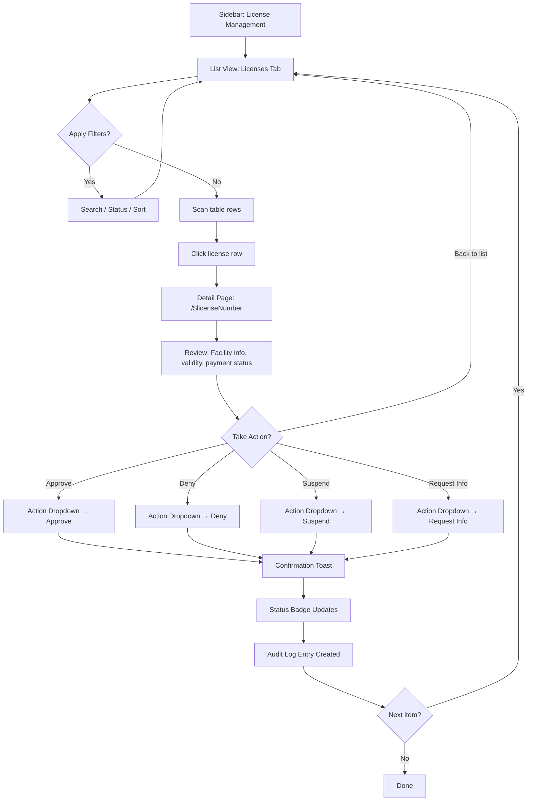
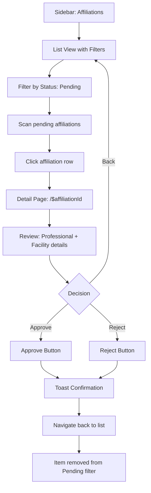
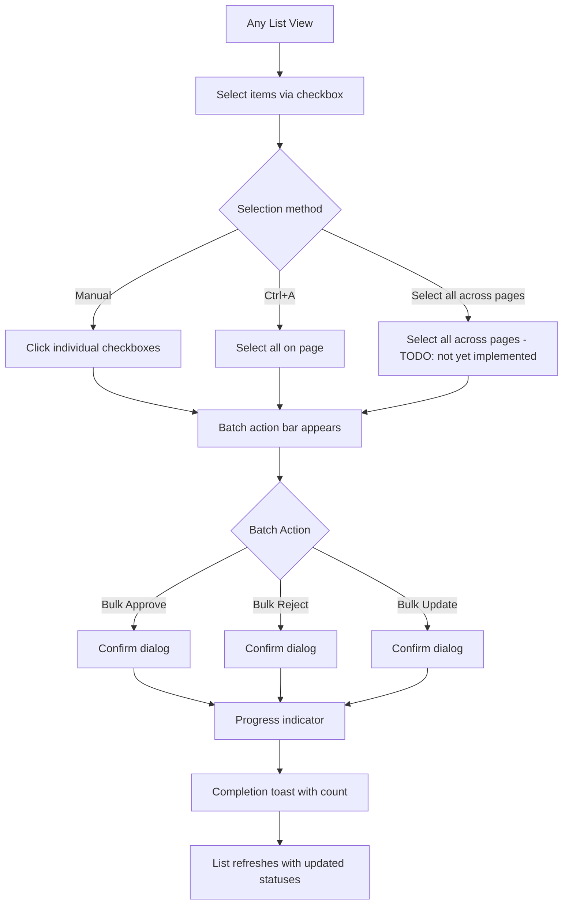
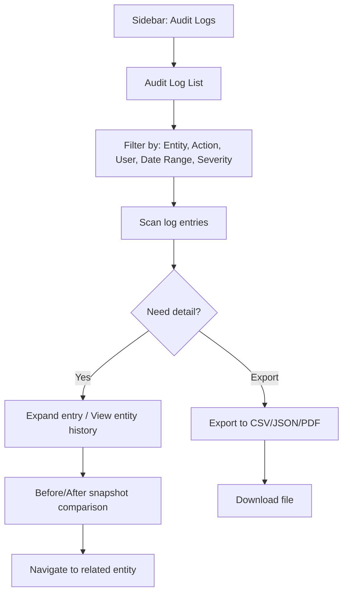

# UX Design Specification careverse_regulator-bench

**Author:** Eric
**Date:** 2026-03-29

---

## Executive Summary

### Project Vision

Careverse Regulator is a multi-tenant regulatory compliance portal for healthcare regulatory bodies. Built as a React 19 SPA on the Frappe framework, it provides a professional, data-dense interface for managing affiliations, licensing, inspections, audit trails, batch operations, documents, forms, and user roles. Each tenant (company) operates in strict data isolation.

The design system must serve as the **single authoritative reference** for all AI agents implementing UI in this project — unifying the existing organic theming layers into a coherent, documented specification.

### Target Users

- **Regulator Admins/Managers** — senior staff configuring the system, managing users and roles
- **Compliance Regulators** — day-to-day operators reviewing licenses, approving affiliations, running inspections
- **Regulator Users** — read-heavy users monitoring status, reviewing audit logs, running reports

Users are professional government/regulatory staff: moderate tech-savviness, desktop-primary (mobile needed for field inspections), high data density tolerance, strong need for trust and clarity.

### Key Design Challenges

- **Three overlapping token systems** (portal-\*, shadcn OKLch, antd bridge) that need unification into a single source of truth for agents
- **Dual dark mode selectors** (`data-theme='dark'` + `.dark` class) must remain synchronized
- **No formalized semantic color system** — status colors are hardcoded across components rather than mapped through tokens
- **Typography loads 5 font families** with inconsistent usage — needs clear hierarchy rules
- **Organic growth** — patterns evolved feature-by-feature; need consolidation without breaking existing UI

### Design Opportunities

- **Formalize the token architecture** into a single authoritative design system reference
- **Codify the status/severity color system** with semantic tokens agents can reference by name
- **Document component composition patterns** (card variants, filter bars, list/detail layouts) as reusable recipes
- **Establish spacing and layout rules** that prevent visual drift as new features are added
- **Create a component variant catalog** so agents pick from defined options rather than inventing new ones

## Core User Experience

### Defining Experience

The design system's core purpose is **visual consistency across all feature domains**. When an AI agent builds a new view or extends an existing module, it must produce UI indistinguishable from what already exists — without reading raw CSS files. The design system is the single reference that makes this possible.

### Platform Strategy

| Platform | Breakpoint | Primary Interaction | Layout Strategy                                            |
| -------- | ---------- | ------------------- | ---------------------------------------------------------- |
| Desktop  | >= 1200px  | Mouse/keyboard      | Data-dense tables, multi-column layouts, action dropdowns  |
| Tablet   | 768-1199px | Touch/mouse         | Collapsed navigation, adjusted grids, condensed spacing    |
| Mobile   | < 768px    | Touch               | Card-based layouts, stacked filters, focused single-column |

- Responsive behavior controlled via `useResponsive()` hook returning `isMobile`, `isTablet`, `isDesktop`
- No offline requirement — always connected to Frappe backend
- All views must provide desktop (table) and mobile (card) variants

### Effortless Interactions

- **Theme switching**: Light/dark seamless with zero flash or unstyled content
- **Status recognition**: Entity state (license, affiliation, inspection) instantly recognizable from color alone
- **Data scanning**: Consistent visual hierarchy across tables, cards, and detail pages
- **Action discovery**: Approve/reject/suspend actions consistently placed and obviously available
- **Navigation continuity**: Moving between feature domains feels like one unified product

### Critical Success Moments

1. An agent uses the design system to build a new view and it **looks correct without manual CSS tweaking**
2. A user switches between feature domains and the UI **feels like one cohesive product**
3. Dark mode is toggled and **every component, gradient, and border adapts correctly**
4. A new status type is added and it **maps to the semantic color system automatically**

### Experience Principles

1. **Token-first** — Every color, spacing, shadow, and radius references a defined token. No magic numbers, no hardcoded hex values.
2. **Semantic over literal** — Use semantic names (`status-success`, `surface-card`) not implementation details (`green-600`, `white`).
3. **Composition over invention** — Agents compose from existing patterns (card + filter bar + table). Never invent new visual patterns.
4. **Dark mode is not an afterthought** — Every decision must work in both modes from the start. If it doesn't have a dark variant, it's not done.
5. **Progressive density** — Desktop gets data density, mobile gets focused clarity. Same data, adapted presentation.

## Desired Emotional Response

### Primary Emotional Goals

- **Confident and in control** — Users make regulatory decisions affecting healthcare facilities and professionals. The UI must project authority and trustworthiness through consistency, clear feedback, and predictable behavior.
- **Efficient and focused** — Users process high volumes of data daily. The design system must reduce cognitive load through scannable layouts, clear hierarchy, and minimal visual noise.
- **Calm authority** — Healthcare regulation is serious but the UI should not feel sterile. Teal palette, rounded corners, and smooth transitions soften the institutional feel while maintaining professionalism.

### Emotional Journey Mapping

| Stage         | Desired Feeling       | Design System Support                                                |
| ------------- | --------------------- | -------------------------------------------------------------------- |
| Login/Landing | Oriented, welcomed    | Company branding, clean dashboard, clear navigation                  |
| Data browsing | Focused, efficient    | Consistent table/card patterns, effective filters, clear pagination  |
| Taking action | Confident, decisive   | Obvious action buttons, confirmation feedback, audit trail awareness |
| Error/failure | Informed, not alarmed | Clear error states, actionable messages, no destructive red overuse  |
| Returning     | Familiar, productive  | Consistent layouts across sessions, remembered preferences           |

### Micro-Emotions

- **Confidence over confusion** — Every interactive element has a clear affordance and predictable outcome
- **Trust over skepticism** — Consistent visual language across all feature domains builds institutional trust
- **Accomplishment over frustration** — Actions provide immediate, visible feedback (toasts, status changes, audit entries)
- **Focus over overwhelm** — Progressive disclosure and information hierarchy prevent cognitive overload

### Design Implications

| Emotional Goal | Design System Choice                                                                 |
| -------------- | ------------------------------------------------------------------------------------ |
| Confidence     | Consistent component patterns, clear action feedback, predictable layouts            |
| Efficiency     | High data density on desktop, scannable tables, keyboard shortcuts, debounced search |
| Calm authority | Teal primary palette, generous whitespace, smooth 0.15-0.16s transitions             |
| Trust          | No jarring animations, seamless dark mode, professional typography                   |
| Clarity        | Semantic status colors, clear visual hierarchy, distinct surface boundaries          |

### Emotional Design Principles

1. **Professional warmth** — Authoritative but approachable. Teal over blue, rounded over sharp, warm grey over cold grey.
2. **Quiet confidence** — Subtle transitions (0.15-0.28s), no bouncing or attention-grabbing animations. The UI is a tool, not a performance.
3. **Immediate feedback** — Every action confirms itself. Toast on success, clear error on failure, visible state change on mutation.
4. **Respectful density** — Show the data users need without overwhelming. Tables for power users, cards for scanning, detail pages for deep review.
5. **Zero surprises** — Consistent placement of actions, filters, pagination across all domains. Once you learn one view, you know them all.

## UX Pattern Analysis & Inspiration

### Inspiring Products Analysis

| Product              | Key UX Strength                                                              | Relevance to Careverse Regulator                                  |
| -------------------- | ---------------------------------------------------------------------------- | ----------------------------------------------------------------- |
| **Linear**           | Keyboard-first, information density, seamless dark mode, glass effects       | Sidebar/content layout, dark mode approach, glassmorphism         |
| **Vercel Dashboard** | Clean data tables, status badges, minimal palette, strong hierarchy          | Table/card responsive pattern, status badge conventions           |
| **Stripe Dashboard** | Professional data-heavy UI, clear typography, powerful filters, detail pages | Tabs pattern, detail-page-not-modal philosophy, filter bar design |

### Transferable UX Patterns

| Pattern                  | Implementation                                              | Design System Codification                                                                                |
| ------------------------ | ----------------------------------------------------------- | --------------------------------------------------------------------------------------------------------- |
| Glass surfaces           | `backdrop-filter: blur(10-14px)` with portal surface tokens | Use existing `.glass-pro-card` class (defined in `index.css`) — do NOT create a new `surface-glass` token |
| Status badge system      | Color-coded with semantic meaning per status                | Formalize as semantic status token map                                                                    |
| Table → Card responsive  | `useResponsive()` hook toggling layouts                     | Document as required pattern for all list views                                                           |
| Command palette          | cmdk library, keyboard shortcut triggered                   | Document trigger convention and placement                                                                 |
| Toast feedback           | Sonner toasts on all mutations                              | Document toast patterns (success/error/info)                                                              |
| Detail pages over modals | Route-based detail pages, no modal patterns                 | Enforce as architectural rule                                                                             |

### Anti-Patterns to Avoid

- **Dashboard widget overload** — Every dashboard element must answer a specific regulatory question. No decorative metrics.
- **Inconsistent status colors** — All badges for the same semantic status must use the same token. No ad-hoc hex values.
- **Modal cascades** — Detail views and complex forms use dedicated pages/routes. Modals only for: (1) destructive confirmations, (2) simple creation forms with ≤6 fields (e.g., `CreateUserDialog.tsx`). Never nest modals or use modals for entity detail views.
- **Over-animation** — Regulatory staff want fast and predictable. Max transition: 0.28s. No bouncing, no spring physics.
- **Dark mode as afterthought** — Both `data-theme='dark'` and `.dark` selectors must be updated together. No light-only components.
- **Typography soup** — Use the defined font stack (see Typography System section). Don't introduce new fonts.
- **Manual memoization in new code** — React Compiler handles memoization. Do NOT add `useMemo`, `useCallback`, or `React.memo` in new code. ~26 existing files still use these (tech debt from pre-Compiler migration) — do not copy that pattern. When touching those files, remove manual memoization if the change scope allows.

### Design Inspiration Strategy

**Adopt directly:**

- Linear's glass surface treatment for headers and elevated panels
- Stripe's detail-page architecture for entity views
- Vercel's status badge visual language for consistency

**Adapt for regulatory context:**

- Linear's keyboard-first approach — add shortcuts for common regulatory actions (approve, reject, next item)
- Stripe's filter bar — extend with saved filter presets for compliance workflows

**Avoid:**

- Consumer app patterns (gamification, engagement metrics, social features)
- Complex animated transitions that slow down high-volume workflows
- Nested modals or drawer-within-drawer patterns

## Design System Foundation

### Design System Choice

**Themeable Component System**: shadcn/ui + Radix UI + Tailwind CSS 4

This project uses a layered design system where components are owned (not imported from a library), styled via CSS custom properties in OKLch color space, and composed using Radix UI headless primitives with CVA (Class Variance Authority) for type-safe variants.

### Rationale for Selection

- **Ownership**: shadcn/ui components live in `src/components/ui/` — fully customizable, no external dependency lock-in
- **Accessibility**: Radix UI primitives provide WCAG-compliant keyboard navigation, focus management, and ARIA attributes
- **Modern color science**: OKLch color space enables perceptually uniform color manipulation across light/dark modes
- **Type safety**: CVA provides exhaustive variant definitions with TypeScript inference
- **Tailwind 4 CSS-first config**: No JavaScript config file — theme is defined directly in `index.css` via `@theme inline`

### Implementation Approach

The design system is already implemented with a **three-layer token architecture**:

| Layer                      | Scope             | Selector                             | Purpose                                                                                                                                                                                                                                                                            |
| -------------------------- | ----------------- | ------------------------------------ | ---------------------------------------------------------------------------------------------------------------------------------------------------------------------------------------------------------------------------------------------------------------------------------- |
| **shadcn/ui OKLch tokens** | Component-level   | `:root` / `.dark`                    | Colors for all UI primitives (buttons, cards, inputs, badges)                                                                                                                                                                                                                      |
| **Portal CSS variables**   | Application shell | `:root` / `:root[data-theme='dark']` | Background gradients, glass surfaces, header/sidebar, shadows                                                                                                                                                                                                                      |
| **Ant Design bridge**      | Legacy/CSS-only   | `:root` / `:root[data-theme='dark']` | CSS token bridge from prior Ant Design usage. **No `antd` imports remain in frontend code.** Bridge CSS persists in `index.css` (e.g., `.glass-pro-card .ant-pro-card-*` selectors) but no Ant components are rendered. Safe to ignore for new development — do NOT import `antd`. |

### Token Layer Decision Rules

When building or styling a component, use this decision tree to pick the correct token layer:

| You're styling...                                  | Use this layer           | Token prefix                                                     | Example                                     |
| -------------------------------------------------- | ------------------------ | ---------------------------------------------------------------- | ------------------------------------------- |
| A shadcn/ui component (button, card, input, badge) | **shadcn OKLch tokens**  | `--background`, `--primary`, `--card`, etc. via Tailwind classes | `bg-card`, `text-primary`, `border-border`  |
| The app shell (header, sidebar, page background)   | **Portal CSS variables** | `--portal-*`                                                     | `var(--portal-bg)`, `var(--portal-surface)` |
| A glass/elevated surface in the shell              | **Portal CSS variables** | `--portal-surface`, `.glass-pro-card`                            | `background: var(--portal-surface)`         |
| A chart or data visualization                      | **shadcn chart tokens**  | `--chart-1` through `--chart-5`                                  | `hsl(var(--chart-1))`                       |
| An Ant Design component (legacy, if any remain)    | **Ant Design bridge**    | `--ant-*`                                                        | Avoid — no antd imports remain in frontend  |

**Rule of thumb:** If you're in `components/ui/` or feature domain components, use shadcn tokens via Tailwind classes. If you're in layout/shell code, use portal variables. Never mix portal tokens into component-level styling.

### Customization Strategy

- **shadcn config**: `components.json` — style `radix-vega`, base color `stone`, icon library `lucide`, menu color `default-translucent`
- **New components**: Follow shadcn conventions — CVA variants, `cn()` utility from `@/lib/utils`, Radix primitives when interactive
- **Theme modifications**: Edit CSS custom properties in `index.css` `:root` and `.dark` blocks — never hardcode values in components
- **Dark mode sync**: `useThemeBridge()` hook synchronizes Zustand store → `data-theme` attribute + `.dark` class simultaneously

## Defining Core Experience

### The Core Interaction Loop

Every feature domain in Careverse Regulator follows the same fundamental pattern:

**List → Filter → Select → Review → Act**

1. **List**: See a paginated table (desktop) or card grid (mobile) of regulatory items
2. **Filter**: Narrow by status, search term, sort order, or date range
3. **Select**: Click a row/card to navigate to the detail page
4. **Review**: Read entity details, history, related documents, audit trail
5. **Act**: Take a regulatory decision (approve, reject, suspend, request info, etc.)

This loop must feel identical across Affiliations, Licensing, Inspections, and all future domains. An agent building a new module should produce this pattern without being told.

### User Mental Model

Regulatory staff think in terms of **queues and decisions**:

- "What needs my attention?" → Filtered list sorted by urgency/status
- "What's the full picture?" → Detail page with all relevant context
- "What action should I take?" → Clear action buttons with confirmation
- "What did I just do?" → Toast feedback + audit trail entry

They bring mental models from email (inbox/detail), spreadsheets (filter/sort), and government forms (review/stamp). The UI must respect these familiar patterns while being faster and more reliable.

### Success Criteria

| Criteria                 | Metric                                              | Design System Implication                                            |
| ------------------------ | --------------------------------------------------- | -------------------------------------------------------------------- |
| Recognition              | User identifies item status in < 1 second           | Semantic status colors, consistent badge placement                   |
| Navigation               | List-to-detail in 1 click, back-to-list in 1 click  | Route-based navigation, breadcrumbs, browser back support            |
| Action confidence        | User knows exactly what will happen before clicking | Clear button labels, confirmation dialogs for destructive actions    |
| Feedback loop            | Action result visible within 500ms                  | Toast notification + immediate status badge update                   |
| Cross-domain consistency | New module feels familiar on first use              | Shared layout patterns, identical filter/table/pagination components |

### Established Patterns (No Novel UX Required)

This project uses **exclusively established UX patterns** — no user education needed:

| Pattern                     | Usage                | Implementation                                  |
| --------------------------- | -------------------- | ----------------------------------------------- |
| Data table with sort/filter | All list views       | Shared table component + filter bar             |
| Card grid for mobile        | Mobile list views    | Responsive card component                       |
| Detail page (not modal)     | Entity review        | Route-based page with breadcrumb back           |
| Action dropdown             | Regulatory decisions | DropdownMenu with role-gated items              |
| Status badge                | State indication     | Semantic color-coded Badge component            |
| Toast notification          | Action feedback      | Sonner toast (success/error/info)               |
| Tabs                        | Sub-categorization   | Tabs component (e.g., Licenses \| Applications) |
| Pagination                  | Large datasets       | Shared pagination with page numbers             |
| Search with debounce        | Quick filtering      | 300ms debounced text input                      |

### Experience Mechanics

**1. Initiation** — User lands on a domain list view via sidebar navigation. Data loads via Zustand store action. Loading skeleton shown during fetch.

**2. Interaction** — User filters (search, status dropdown, sort), scans results in table/cards. Clicks a row to navigate to `/{domain}/$entityId` detail page.

**3. Feedback** — Filter changes are instant (client-side). Navigation to detail shows loading state then renders full entity context. Action buttons reflect available transitions based on current status.

**4. Completion** — User takes action (approve/reject/etc.) → confirmation toast appears → status badge updates → audit log entry created. User navigates back to list or to next item.

## Visual Design Foundation

### Color System

#### Primary Palette (OKLch)

The color system uses OKLch color space for perceptually uniform color manipulation. All values are defined as CSS custom properties in `index.css`.

> **IMPORTANT:** Agents must NEVER use hex values or OKLch values directly in components. Always reference tokens via Tailwind utility classes (`bg-background`, `text-primary`, `border-border`, etc.). The OKLch values below are for reference only — they are the source of truth in `index.css`.

**Core Semantic Tokens (Light Mode):**

| Token                    | OKLch Value                  | Tailwind Class                       | Usage                           |
| ------------------------ | ---------------------------- | ------------------------------------ | ------------------------------- |
| `--background`           | `oklch(0.975 0.002 106.424)` | `bg-background`                      | Page background                 |
| `--foreground`           | `oklch(0.147 0.004 49.25)`   | `text-foreground`                    | Primary text                    |
| `--card`                 | `oklch(1 0 0)`               | `bg-card`                            | Card/surface background         |
| `--card-foreground`      | `oklch(0.147 0.004 49.25)`   | `text-card-foreground`               | Card text                       |
| `--primary`              | `oklch(0.694 0.123 181.083)` | `bg-primary`, `text-primary`         | Primary actions, links, accents |
| `--primary-foreground`   | `oklch(0.985 0.02 181)`      | `text-primary-foreground`            | Text on primary                 |
| `--secondary`            | `oklch(0.967 0.001 286.375)` | `bg-secondary`                       | Secondary surfaces              |
| `--secondary-foreground` | `oklch(0.21 0.006 285.885)`  | `text-secondary-foreground`          | Text on secondary               |
| `--muted`                | `oklch(0.94 0.003 106.424)`  | `bg-muted`                           | Muted backgrounds               |
| `--muted-foreground`     | `oklch(0.553 0.013 58.071)`  | `text-muted-foreground`              | Secondary text                  |
| `--accent`               | `oklch(0.94 0.003 106.424)`  | `bg-accent`                          | Accent backgrounds              |
| `--destructive`          | `oklch(0.577 0.245 27.325)`  | `bg-destructive`, `text-destructive` | Destructive actions             |
| `--border`               | `oklch(0.923 0.003 48.717)`  | `border-border`                      | Borders                         |
| `--input`                | `oklch(0.923 0.003 48.717)`  | `border-input`                       | Input borders                   |
| `--ring`                 | `oklch(0.709 0.01 56.259)`   | `ring-ring`                          | Focus rings                     |

**Core Semantic Tokens (Dark Mode):**

Dark mode values are applied automatically via the `.dark` selector in `index.css`. Agents do NOT need to specify dark variants for these tokens — Tailwind resolves them automatically. The values below are for reference.

| Token                | OKLch Value                  | Usage                              |
| -------------------- | ---------------------------- | ---------------------------------- |
| `--background`       | `oklch(0.147 0.004 49.25)`   | Page background                    |
| `--foreground`       | `oklch(0.985 0.001 106.423)` | Primary text                       |
| `--card`             | `oklch(0.216 0.006 56.043)`  | Card/surface background            |
| `--primary`          | `oklch(0.694 0.123 181.083)` | Primary (same hue, adapts context) |
| `--muted`            | `oklch(0.268 0.007 34.298)`  | Muted backgrounds                  |
| `--muted-foreground` | `oklch(0.709 0.01 56.259)`   | Secondary text                     |
| `--destructive`      | `oklch(0.704 0.191 22.216)`  | Destructive (lighter for dark bg)  |
| `--border`           | `oklch(1 0 0 / 10%)`         | Borders (translucent white)        |
| `--input`            | `oklch(1 0 0 / 15%)`         | Input borders (translucent white)  |

**Portal Shell Tokens:**

| Token                     | Light                  | Dark                 | Usage           |
| ------------------------- | ---------------------- | -------------------- | --------------- |
| `--portal-bg`             | #f4f7fb                | #08101d              | App background  |
| `--portal-bg-deep`        | #edf2f7                | #0b1728              | Deep background |
| `--portal-surface`        | rgba(255,255,255,0.82) | rgba(15,23,42,0.68)  | Glass surfaces  |
| `--portal-surface-strong` | rgba(255,255,255,0.92) | rgba(15,23,42,0.82)  | Solid surfaces  |
| `--portal-text`           | #0f172a                | #e2e8f0              | Shell text      |
| `--portal-body`           | #334155                | #cbd5e1              | Body text       |
| `--portal-muted`          | #64748b                | #94a3b8              | Muted text      |
| `--portal-teal`           | #0f766e                | #0f766e              | Brand accent    |
| `--portal-danger`         | #dc2626                | #dc2626              | Danger accent   |
| `--portal-border`         | #d8e1eb                | rgba(71,85,105,0.48) | Shell borders   |

**Chart Colors (Data Visualization):**

| Token       | OKLch Value                  | Usage               |
| ----------- | ---------------------------- | ------------------- |
| `--chart-1` | `oklch(0.871 0.15 154.449)`  | Primary data series |
| `--chart-2` | `oklch(0.723 0.219 149.579)` | Secondary series    |
| `--chart-3` | `oklch(0.627 0.194 149.214)` | Tertiary series     |
| `--chart-4` | `oklch(0.527 0.154 150.069)` | Quaternary series   |
| `--chart-5` | `oklch(0.448 0.119 151.328)` | Quinary series      |

**Sidebar Tokens:**

| Token               | Light OKLch                  | Dark OKLch                  |
| ------------------- | ---------------------------- | --------------------------- |
| `--sidebar`         | `oklch(0.985 0.001 106.423)` | `oklch(0.216 0.006 56.043)` |
| `--sidebar-primary` | `oklch(0.596 0.145 163.225)` | `oklch(0.696 0.17 162.48)`  |
| `--sidebar-accent`  | `oklch(0.94 0.003 106.424)`  | `oklch(0.268 0.007 34.298)` |

#### Semantic Status Colors

Status colors MUST be used consistently across all domains. These are NOT yet defined as CSS custom properties (TODO: create `--status-*` tokens in `index.css`). Until then, agents must use the Tailwind classes below — never raw hex values.

| Status Semantic           | Tailwind Classes (Light)     | Tailwind Classes (Dark)                    | Usage                           |
| ------------------------- | ---------------------------- | ------------------------------------------ | ------------------------------- |
| Success/Active/Approved   | `text-teal-700 bg-teal-50`   | `dark:text-teal-400 dark:bg-teal-950/30`   | Active licenses, approved items |
| Warning/Attention         | `text-amber-700 bg-amber-50` | `dark:text-amber-400 dark:bg-amber-950/30` | Expiring, needs attention       |
| Danger/Rejected/Suspended | `text-red-600 bg-red-50`     | `dark:text-red-400 dark:bg-red-950/30`     | Rejected, suspended, revoked    |
| Info/In Review            | `text-cyan-700 bg-cyan-50`   | `dark:text-cyan-400 dark:bg-cyan-950/30`   | Under review, processing        |
| Neutral/Pending           | `text-slate-500 bg-slate-50` | `dark:text-slate-400 dark:bg-slate-800/30` | Pending, draft, inactive        |

> **Implementation note:** Each domain currently has its own `StatusBadge.tsx` with a status-to-color map. When building a new domain, copy the pattern from an existing `StatusBadge.tsx` and adjust the status enum. Consolidating to shared `--status-*` tokens is planned but not yet done.

#### Background Gradients

**Page Background (applied to `.hq-portal`):**

```css
/* Light */
radial-gradient(900px 520px at 8% -10%, rgba(15, 118, 110, 0.15), transparent),
radial-gradient(780px 420px at 100% -4%, rgba(21, 128, 61, 0.12), transparent),
linear-gradient(180deg, var(--portal-bg), var(--portal-bg-deep))

/* Dark — same structure, slightly higher opacity */
radial-gradient(900px 520px at 8% -10%, rgba(15, 118, 110, 0.16), transparent),
radial-gradient(780px 420px at 100% -4%, rgba(21, 128, 61, 0.14), transparent),
linear-gradient(180deg, var(--portal-bg), var(--portal-bg-deep))
```

### Typography System

#### Font Stack

> **Known issue:** 5 font families are loaded (Public Sans, Manrope, Plus Jakarta Sans, Raleway, Roboto). This is tech debt from organic growth. The rules below define which to use — do NOT introduce additional fonts.

| Role                       | Font Family                             | Defined In                                           | Weights       | Usage                                                    |
| -------------------------- | --------------------------------------- | ---------------------------------------------------- | ------------- | -------------------------------------------------------- |
| **Body (primary)**         | Public Sans, Manrope, Plus Jakarta Sans | `index.css` `font-family` rule (line ~1934 override) | 400-700       | All body text, UI labels, descriptions                   |
| **Headings**               | Roboto Variable (`font-heading`)        | Tailwind `@theme inline` `--font-heading`            | 500, 600, 700 | Section headings, page titles (use `font-heading` class) |
| **Tailwind sans fallback** | Raleway Variable (`font-sans`)          | Tailwind `@theme inline` `--font-sans`               | 400-700       | Applied when using Tailwind `font-sans` class            |

**Agent guidance:** Body text inherits from the CSS `font-family` rule (Public Sans stack). For headings, explicitly use `font-heading` Tailwind class. Do not reference fonts by name in component styles — use the Tailwind classes or inherit.

#### Type Scale

| Level   | Size                     | Weight  | Line Height | Usage                        |
| ------- | ------------------------ | ------- | ----------- | ---------------------------- |
| Display | clamp(1.5rem, 4vw, 2rem) | 800     | 1.1         | Hero titles, brand marks     |
| H1      | 1.75rem (28px)           | 700     | 1.2         | Page titles                  |
| H2      | 1.5rem (24px)            | 700     | 1.25        | Section headings             |
| H3      | 1.25rem (20px)           | 600     | 1.3         | Subsection headings          |
| H4      | 1rem (16px)              | 600     | 1.4         | Card titles, labels          |
| Body    | 0.875rem (14px)          | 400-500 | 1.5         | Default text                 |
| Small   | 0.8125rem (13px)         | 500     | 1.4         | Secondary text, metadata     |
| XS      | 0.75rem (12px)           | 500     | 1.4         | Badges, captions, timestamps |
| XXS     | 0.6875rem (11px)         | 500     | 1.3         | Micro labels                 |

#### Typography Rules for Agents

- **NEVER** introduce new font families — use the defined stack
- **Body text**: `text-sm` (14px) is the default — not `text-base` (16px)
- **Muted text**: Use `text-muted-foreground` — never `text-gray-500`
- **Bold headings**: Use `font-semibold` (600) for most headings, `font-bold` (700) for page titles only
- **Responsive**: Use `clamp()` for display text only. Standard text sizes are fixed.

### Spacing & Layout Foundation

#### Base Spacing Unit

Base unit: **4px (0.25rem)**. All spacing derives from this unit.

| Token   | Value | Tailwind       | Usage                   |
| ------- | ----- | -------------- | ----------------------- |
| space-1 | 4px   | `gap-1`, `p-1` | Tight inline spacing    |
| space-2 | 8px   | `gap-2`, `p-2` | Compact element spacing |
| space-3 | 12px  | `gap-3`, `p-3` | Default element spacing |
| space-4 | 16px  | `gap-4`, `p-4` | Card padding (mobile)   |
| space-5 | 20px  | `gap-5`, `p-5` | Section spacing         |
| space-6 | 24px  | `gap-6`, `p-6` | Card padding (desktop)  |
| space-8 | 32px  | `gap-8`, `p-8` | Major section gaps      |

#### Border Radius Scale

| Token       | Value  | Tailwind       | Usage                    |
| ----------- | ------ | -------------- | ------------------------ |
| radius-sm   | ~4.3px | `rounded-sm`   | Inputs, small elements   |
| radius-md   | ~5.8px | `rounded-md`   | Buttons, form controls   |
| radius-lg   | 7.2px  | `rounded-lg`   | Default component radius |
| radius-xl   | ~10px  | `rounded-xl`   | Cards, panels            |
| radius-2xl  | ~13px  | `rounded-2xl`  | Large cards, modals      |
| radius-full | 999px  | `rounded-full` | Badges, pills, avatars   |
| portal-sm   | 10px   | custom         | Portal compact elements  |
| portal-md   | 14px   | custom         | Portal medium surfaces   |
| portal-lg   | 20px   | custom         | Portal large surfaces    |

#### Shadow Scale

| Token            | Light Value                       | Dark Value                      | Usage                              |
| ---------------- | --------------------------------- | ------------------------------- | ---------------------------------- |
| shadow-soft      | `0 12px 24px rgba(15,23,42,0.06)` | `0 12px 26px rgba(2,6,23,0.52)` | Elevated cards                     |
| shadow-strong    | `0 24px 52px rgba(15,23,42,0.12)` | `0 24px 56px rgba(2,6,23,0.62)` | Modals, overlays                   |
| shadow-md        | Tailwind default                  | —                               | Standard card elevation            |
| dark:shadow-none | —                                 | No shadow                       | Cards in dark mode use border only |

**Card shadow pattern:**

- Light: `shadow-md border border-border/60`
- Dark: `dark:shadow-none dark:border-foreground/15`

#### Layout Dimensions

| Element                   | Value                        | Tailwind / CSS                         | Notes                                               |
| ------------------------- | ---------------------------- | -------------------------------------- | --------------------------------------------------- |
| Header height             | 64px (4rem)                  | `h-16`                                 | Sticky, `z-40`, `bg-card/80 backdrop-blur-lg`       |
| Sidebar width (expanded)  | 256px (16rem)                | `w-64` / `var(--sidebar-width)`        | Collapsible                                         |
| Sidebar width (collapsed) | 80px (5rem)                  | `w-20`                                 | Icon-only mode                                      |
| Sidebar width (mobile)    | 288px (18rem)                | `SIDEBAR_WIDTH_MOBILE`                 | Full-width overlay                                  |
| Content max-width         | 1360px                       | `max-width: 1360px` (portal container) | Dashboard pages only; standard pages are full-width |
| Content padding (desktop) | 24px (1.5rem)                | `p-6`                                  | Main content area                                   |
| Content padding (mobile)  | 16px (1rem)                  | `p-4`                                  | Main content area                                   |
| Dashboard padding         | 22px horizontal, 38px bottom | CSS `!important` override              | Legacy portal container                             |
| Table row height          | 44px min                     | `min-h-[44px]`                         | Touch target compliance                             |

#### Responsive Breakpoints

| Name    | Width      | Behavior                                               |
| ------- | ---------- | ------------------------------------------------------ |
| Mobile  | < 768px    | Single column, cards replace tables, stacked filters   |
| Tablet  | 768-1199px | Adjusted grids, condensed spacing, collapsible sidebar |
| Desktop | >= 1200px  | Full layout, data tables, multi-column                 |

### Accessibility Considerations

- **Color contrast**: Text/background combinations target WCAG AA (4.5:1 for normal text, 3:1 for large text). **Known risk:** `text-muted-foreground` (~#78716c) on `bg-card` (#ffffff) yields ~4.5:1 — passes AA at 14px (body) but is borderline at 13px ("Small") and fails at 12px ("XS"). Avoid `text-muted-foreground` at sizes below 14px; use `text-foreground` instead for XS/XXS text
- **Focus indicators**: 3px ring with `ring/50` opacity on all interactive elements
- **Touch targets**: Minimum 44px height for all interactive elements (buttons, table rows, menu items)
- **Font sizes**: Minimum 12px (XS) — never smaller. Default body is 14px.
- **Motion**: Transitions max 0.28s. `prefers-reduced-motion` support is NOT yet implemented (TODO). When adding new animations, wrap with Tailwind `motion-safe:` prefix to begin building this support incrementally.
- **Keyboard**: All interactive components support full keyboard navigation via Radix UI primitives
- **Screen readers**: Semantic HTML, ARIA labels on icon-only buttons, status announcements via live regions

## Design Direction Decision

### Design Direction: Established

The visual direction for Careverse Regulator is already implemented and proven. This section codifies the existing direction as the canonical reference — not a choice to be made, but a decision to be documented.

### Chosen Direction: Professional Glass

**Visual Identity:** Clean, modern regulatory portal with glassmorphism accents, teal-driven color palette, and warm neutral foundations.

**Key Characteristics:**

- **Surface model**: White cards on warm grey background (light), dark slate cards on deep navy (dark)
- **Glass effects**: Semi-transparent header and sidebar with `backdrop-filter: blur(10px)`
- **Elevation**: Shadows in light mode (`shadow-md`), border-only in dark mode (`shadow-none`)
- **Color accent**: Teal (#0f766e) as primary — conveys healthcare/trust without the coldness of blue
- **Gradient backgrounds**: Subtle teal/green radial gradients on page background for depth
- **Density**: Information-dense on desktop, focused on mobile — progressive density approach
- **Corners**: Generous radius (10-20px for portal elements, 7.2px base for components) — approachable, not clinical
- **Transitions**: Subtle and fast (0.15-0.28s) — professional, no playfulness

### Design Rationale

| Decision                                    | Rationale                                                                                                                                                                     |
| ------------------------------------------- | ----------------------------------------------------------------------------------------------------------------------------------------------------------------------------- |
| Teal primary over blue                      | Healthcare affinity + warmth. Blue is overused in government tools and feels cold.                                                                                            |
| Warm grey (stone) over cool grey            | Softens the institutional feel. Stone base gives warmth without being unprofessional.                                                                                         |
| Glassmorphism on header/sidebar             | Creates visual hierarchy between shell and content. Feels modern without being trendy.                                                                                        |
| Shadow in light, border in dark             | Shadows disappear on dark backgrounds. Borders provide structure without fake depth.                                                                                          |
| OKLch color space                           | Perceptually uniform — colors look equally vivid across the palette. Future-proof for CSS color manipulation.                                                                 |
| No modals for detail views or complex forms | Regulatory decisions need full context. Modals constrain information. Detail pages allow deep review. Exception: simple creation dialogs (≤6 fields) like `CreateUserDialog`. |
| 14px default body text                      | Balances density with readability. Smaller than most apps but appropriate for professional data-heavy UI.                                                                     |

### Implementation Approach

The design direction is implemented through the three-layer token system:

1. **shadcn/ui OKLch tokens** control component-level styling (buttons, inputs, cards, badges)
2. **Portal CSS variables** control the application shell (header, sidebar, page background, glass surfaces)
3. **Tailwind @theme inline** maps tokens to utility classes for composition in components

**No HTML mockup generated** — the existing application IS the mockup. The design system specification serves as the reference for maintaining and extending it consistently.

## User Journey Flows

### Journey 1: License Review & Decision



**Entry:** Sidebar navigation → License Management
**Core loop:** Filter → Select → Review → Decide → Confirm
**Feedback:** Toast notification + badge update + audit entry
**Error path:** API failure → error toast → status unchanged → retry available

### Journey 2: Affiliation Approval



### Journey 3: Batch Operations



### Journey 4: Audit Log Investigation



### Journey Patterns

These patterns repeat across ALL domains and must be implemented consistently:

| Pattern               | Description                                          | Components Used                    |
| --------------------- | ---------------------------------------------------- | ---------------------------------- |
| **List → Detail**     | Table/card click navigates to `/{domain}/$id` route  | Table, Card, Router Link           |
| **Filter Bar**        | Search + status dropdown + sort, above the list      | Input, Select, Button Group        |
| **Action Feedback**   | Action → toast → badge update → audit entry          | Sonner, Badge, useAuditLog         |
| **Empty State**       | No results message with suggestion to adjust filters | Empty component with icon          |
| **Loading State**     | Skeleton placeholders during data fetch              | Skeleton component                 |
| **Error State**       | Error message with retry option                      | Alert component + retry button     |
| **Pagination**        | Page numbers + prev/next below list                  | PaginationControls component       |
| **Responsive Switch** | Table on desktop, cards on mobile                    | useResponsive + conditional render |

### Flow Optimization Principles

1. **One click to detail** — Never require intermediate screens between list and detail
2. **Filter persistence** — Filters survive navigation to detail and back (stored in Zustand)
3. **Instant feedback** — Client-side filter/sort is immediate; server operations show loading state
4. **Keyboard shortcuts** — Ctrl/Cmd+A for select all on page (implemented in `useBatchKeyboardShortcuts`), Escape to clear selection, Ctrl+Z to undo, Delete for delete selected. ~~Ctrl+Shift+A for select across pages~~ (NOT yet implemented — TODO)
5. **Breadcrumb back** — Detail pages always show breadcrumb path back to list
6. **Status-first scanning** — Status badge is the first visual element in table rows and cards

## Component Strategy

### Design System Components (shadcn/ui — Available)

All installed shadcn/ui primitives live in `src/components/ui/`. Agents must use these — never create alternatives.

**Layout & Structure:**
| Component | File | Usage |
|-----------|------|-------|
| Card | `card.tsx` | Content containers — `rounded-xl border border-border/60 bg-card shadow-md` (light), `dark:shadow-none dark:border-foreground/15` (dark) |
| Tabs | `tabs.tsx` | Sub-categorization (e.g., Licenses \| Applications) |
| Separator | `separator.tsx` | Visual dividers between sections |
| Scroll Area | `scroll-area.tsx` | Scrollable content panels |
| Resizable | `resizable.tsx` | Resizable panel layouts |
| Sidebar | `sidebar.tsx` | Application sidebar navigation |
| Collapsible | `collapsible.tsx` | Expandable sections |
| Accordion | `accordion.tsx` | Stacked expandable panels |

**Data Display:**
| Component | File | Usage |
|-----------|------|-------|
| Table | `table.tsx` | Data tables (desktop list views) |
| Badge | `badge.tsx` | Status indicators — use semantic status colors |
| Avatar | `avatar.tsx` | User/entity avatars |
| Skeleton | `skeleton.tsx` | Loading placeholders |
| Empty | `empty.tsx` | Empty state displays |
| Progress | `progress.tsx` | Progress indicators |
| Spinner | `spinner.tsx` | Loading spinners |

**Forms & Input:**
| Component | File | Usage |
|-----------|------|-------|
| Button | `button.tsx` | Actions — variants: default, outline, secondary, ghost, destructive, link. Sizes: xs, sm, default, lg, icon |
| Input | `input.tsx` | Text inputs |
| Textarea | `textarea.tsx` | Multi-line text |
| Select | `select.tsx` | Dropdown selection |
| Checkbox | `checkbox.tsx` | Multi-select, batch operations |
| Switch | `switch.tsx` | Toggle settings |
| Radio Group | `radio-group.tsx` | Single selection |
| Calendar | `calendar.tsx` | Date picker (react-day-picker) |
| Input OTP | `input-otp.tsx` | OTP/code input |
| Slider | `slider.tsx` | Range selection |
| Field | `field.tsx` | Form field wrapper with label/error |

**Overlay & Feedback:**
| Component | File | Usage |
|-----------|------|-------|
| Dialog | `dialog.tsx` | Confirmation dialogs (destructive actions ONLY) |
| Sheet | `sheet.tsx` | Slide-out panels |
| Dropdown Menu | `dropdown-menu.tsx` | Action menus on entities |
| Context Menu | `context-menu.tsx` | Right-click menus |
| Popover | `popover.tsx` | Floating content |
| Tooltip | `tooltip.tsx` | Hover hints |
| Alert | `alert.tsx` | Inline alerts |
| Alert Dialog | `alert-dialog.tsx` | Blocking confirmations |
| Sonner (toast) | `sonner.tsx` | Toast notifications — `toast.success()`, `toast.error()` |
| Command | `command.tsx` | Command palette (cmdk) |

**Navigation:**
| Component | File | Usage |
|-----------|------|-------|
| Breadcrumb | `breadcrumb.tsx` | Page hierarchy navigation |
| Navigation Menu | `navigation-menu.tsx` | Top-level navigation |
| Pagination | `pagination.tsx` | Page navigation for lists |
| Menubar | `menubar.tsx` | Menu bar navigation |

### Custom Domain Components

These are project-specific components built on top of shadcn/ui primitives. Each feature domain has its own set:

**Shared Across Domains:**
| Component | Location | Purpose | Composition |
|-----------|----------|---------|-------------|
| StatusBadge | Per-domain `StatusBadge.tsx` | Semantic status display | Badge + status color map |
| PaginationControls | Per-domain `PaginationControls.tsx` | List pagination | Pagination + page numbers |
| FilterBar | Per-domain `*Filters.tsx` | Search + status + sort | Input + Select + Button Group |
| EntityDetailPage | Per-domain route component | Full entity review | Card + data display + action buttons |
| NotificationCenter | `shared/NotificationCenter.tsx` | In-app notifications | Popover + list |
| NotificationListener | `shared/NotificationListener.tsx` | WebSocket listener | Socket.io integration |
| GlobalSearch | `shared/GlobalSearch.tsx` | Cross-domain search | Command palette |

**Per-Domain Pattern (agents must follow for new domains):**
| Component | Naming Pattern | Purpose |
|-----------|---------------|---------|
| `{Domain}View.tsx` | `AffiliationsView.tsx` | Main container with responsive layout |
| `{Domain}Table.tsx` | `AffiliationsTable.tsx` | Desktop table view |
| `{Domain}Card.tsx` | `AffiliationCard.tsx` | Mobile card view |
| `{Domain}Filters.tsx` | `AffiliationsFilters.tsx` | Filter bar |
| `StatusBadge.tsx` | `StatusBadge.tsx` | Domain-specific status colors |
| `PaginationControls.tsx` | `PaginationControls.tsx` | Pagination (or use shared) |

> **Known duplication:** StatusBadge and PaginationControls currently exist as separate copies in each domain (affiliations, licensing, inspection) with slightly different implementations. This is tech debt. **For new domains:** copy the licensing domain's PaginationControls (most feature-complete — includes page size selector) and the nearest domain's StatusBadge as starting points. Consolidation into `components/shared/` is planned but not yet done — do not attempt to refactor existing domains without explicit instruction.

### Component Implementation Strategy

**Rules for agents building components:**

1. **Check `components/ui/` first** — If shadcn has it, use it. Never recreate.
2. **Compose, don't extend** — Build domain components by composing UI primitives. Don't fork or modify `components/ui/` files.
3. **CVA for variants** — Any component with visual variants must use Class Variance Authority with TypeScript inference.
4. **`cn()` for class merging** — Always use `cn()` from `@/lib/utils` for conditional/merged Tailwind classes.
5. **Props over config** — Components receive data and callbacks via props. No internal API calls in UI primitives.
6. **Radix for interaction** — Any component needing keyboard navigation, focus management, or ARIA uses Radix UI headless primitives.

### Component Variant Reference

**Button variants agents should use:**

| Variant       | Class                                    | Usage                                      |
| ------------- | ---------------------------------------- | ------------------------------------------ |
| `default`     | `bg-primary text-primary-foreground`     | Primary actions (Submit, Save)             |
| `outline`     | `border-border bg-background`            | Secondary actions (Cancel, Back)           |
| `secondary`   | `bg-secondary text-secondary-foreground` | Tertiary actions                           |
| `ghost`       | `hover:bg-muted`                         | Minimal actions (icon buttons in toolbars) |
| `destructive` | `bg-destructive/10 text-destructive`     | Dangerous actions (Delete, Revoke)         |
| `link`        | `text-primary underline-offset-4`        | Inline links                               |

**Button sizes:**

| Size      | Class              | Usage                  |
| --------- | ------------------ | ---------------------- |
| `xs`      | `h-6 px-2 text-xs` | Compact inline actions |
| `sm`      | `h-8 px-2.5`       | Table row actions      |
| `default` | `h-9 px-2.5`       | Standard buttons       |
| `lg`      | `h-10 px-2.5`      | Prominent actions      |
| `icon`    | `size-9`           | Icon-only buttons      |

**Badge variants:**

| Variant       | Usage                   |
| ------------- | ----------------------- |
| `default`     | Primary status          |
| `secondary`   | Neutral/informational   |
| `destructive` | Error/danger status     |
| `outline`     | Subtle status indicator |

## UX Consistency Patterns

### Button Hierarchy

Every view follows this action hierarchy:

| Priority           | Variant          | Placement                                      | Example                       |
| ------------------ | ---------------- | ---------------------------------------------- | ----------------------------- |
| Primary action     | `default` (teal) | Top-right of page or card header               | "Save", "Submit", "Create"    |
| Secondary action   | `outline`        | Next to primary                                | "Cancel", "Back", "Reset"     |
| Destructive action | `destructive`    | Separated from primary (dropdown or far right) | "Delete", "Revoke", "Suspend" |
| Tertiary/toolbar   | `ghost`          | Inline or toolbar                              | Icon buttons, "More options"  |
| Inline link        | `link`           | Within text                                    | "View details", "Learn more"  |

**Rules:**

- Maximum ONE primary button per visible context
- Destructive actions require confirmation via AlertDialog
- Icon-only buttons must have `aria-label` and Tooltip
- Action dropdowns use DropdownMenu for multi-action entities

### Feedback Patterns

| Feedback Type | Component          | Duration               | Usage                                              |
| ------------- | ------------------ | ---------------------- | -------------------------------------------------- |
| Success       | `toast.success()`  | 4s auto-dismiss        | After successful mutations (approve, save, update) |
| Error         | `toast.error()`    | Sticky until dismissed | API failures, validation errors                    |
| Info          | `toast.info()`     | 4s auto-dismiss        | Informational messages                             |
| Loading       | Skeleton / Spinner | Until data loads       | Initial page load, data refresh                    |
| Empty         | Empty component    | Persistent             | No results matching filters                        |
| Confirmation  | AlertDialog        | Until user responds    | Before destructive actions only                    |

**Rules:**

- Every mutation shows a toast on success AND failure
- Failed mutations also log to audit via `useAuditLog`
- Never show raw API error messages — always user-friendly text
- Loading states use Skeleton for content areas, Spinner for actions

### Form Patterns

| Pattern       | Implementation                               | Notes                                          |
| ------------- | -------------------------------------------- | ---------------------------------------------- |
| Form library  | React Hook Form + Zod schema                 | All forms use this stack                       |
| Validation    | Zod schema validates on submit               | Show inline errors below fields                |
| Error display | Field component wraps input + error          | Red text below input, border turns destructive |
| Submit button | Primary variant, disabled during submission  | Shows Spinner inside button                    |
| Cancel        | Outline variant, navigates back              | No confirmation if form is pristine            |
| Dirty check   | Warn before navigation if form changed       | Use browser beforeunload or router guard       |
| Field layout  | Single column on mobile, 2-column on desktop | Use `grid grid-cols-1 md:grid-cols-2 gap-4`    |

### Navigation Patterns

| Pattern            | Implementation                          | Usage                                           |
| ------------------ | --------------------------------------- | ----------------------------------------------- |
| Primary navigation | Sidebar with collapsible groups         | Always visible on desktop, hamburger on mobile  |
| Page navigation    | Breadcrumbs at top of content area      | Shows: Home > Domain > Entity                   |
| Tab navigation     | Tabs component within a page            | Sub-categories (e.g., Licenses \| Applications) |
| Back navigation    | Breadcrumb link or browser back         | Both must work — detail pages are bookmarkable  |
| Deep linking       | URL contains all state for current view | Filters stored in Zustand, entity ID in URL     |

### Search & Filter Patterns

| Pattern            | Implementation              | Timing                                 |
| ------------------ | --------------------------- | -------------------------------------- |
| Text search        | Input with search icon      | 300ms debounce                         |
| Status filter      | Select dropdown             | Immediate on change                    |
| Sort               | Button group or Select      | Immediate on change                    |
| Date range         | Calendar picker             | Apply on selection                     |
| Clear all          | "Clear filters" link/button | Resets all to defaults                 |
| Filter persistence | Zustand store per domain    | Survives navigation to detail and back |
| Results count      | Text above table            | "Showing 1-20 of 156 results"          |

**Rules:**

- Filter changes always reset pagination to page 1. **Mechanism:** The Zustand store's `setFilters` action must set `currentPage: 1` before fetching: `set({ filters, currentPage: 1 }); get().fetchItems(1, filters);`
- All list views must support: search, status filter, sort (minimum)
- Filters are client-side when dataset < 500 items, server-side otherwise
- Empty filter state shows all items, not an empty view

### Loading & Empty States

**Loading sequence:**

1. Page skeleton appears immediately (no blank flash)
2. Data fetches via store action
3. Skeleton replaced with content on success
4. Error state shown on failure with retry button

**Empty states by context:**
| Context | Message | Action |
|---------|---------|--------|
| No items exist | "No {items} yet" | Create button if applicable |
| No filter results | "No {items} match your filters" | "Clear filters" link |
| Error loading | "Failed to load {items}" | "Try again" button |
| No permission | "You don't have access to {items}" | Contact admin message |

### Icon Conventions

**Icon library:** Lucide React — never introduce other icon libraries.

| Size  | Tailwind | Usage                                         |
| ----- | -------- | --------------------------------------------- |
| 12px  | `size-3` | Inline with XS text                           |
| 16px  | `size-4` | Default UI icons, button icons, table actions |
| 20px  | `size-5` | Standalone icons, empty state secondary       |
| 24px  | `size-6` | Page header icons, large actions              |
| 32px+ | `size-8` | Empty state primary icon                      |

**Color:** Icons inherit text color. Use `text-muted-foreground` for secondary icons, `text-destructive` for danger.

### Animation & Transition Patterns

| Element        | Transition                               | Duration | Easing             |
| -------------- | ---------------------------------------- | -------- | ------------------ |
| Button hover   | background-color, border-color           | 0.15s    | ease               |
| Card hover     | transform (translateY -1px), box-shadow  | 0.16s    | ease               |
| Focus ring     | ring appearance                          | 0.15s    | ease               |
| Page entrance  | portalRise (translateY 8px → 0, opacity) | 0.28s    | ease               |
| Glass surfaces | backdrop-filter                          | —        | — (always applied) |
| Disabled state | opacity to 0.5                           | 0s       | — (immediate)      |

**Rules:**

- Maximum transition duration: 0.28s
- No spring physics, no bouncing, no attention-seeking animation
- `prefers-reduced-motion` is NOT yet implemented in existing code (TODO). New animations SHOULD use Tailwind `motion-safe:` prefix to build support incrementally
- Hover effects on interactive elements only — never on static content

## Responsive Design & Accessibility

### Responsive Implementation Guidelines

**Approach:** Desktop-first with progressive simplification for smaller screens. The `useResponsive()` hook is the primary mechanism — not CSS media queries alone.

**Desktop (>= 1200px) — Full experience:**

- Data tables with all columns visible
- Sidebar always expanded
- Multi-column form layouts (`grid-cols-2`)
- Action dropdowns inline on rows
- Full filter bar horizontal layout

**Tablet (768-1199px) — Condensed:**

- Tables retain but hide non-essential columns
- Sidebar collapsible (hamburger trigger)
- Forms remain 2-column where space allows
- Filter bar wraps to 2 rows if needed
- Header actions condensed

**Mobile (< 768px) — Focused:**

- Tables replaced with card layouts entirely
- Sidebar hidden, hamburger navigation
- Forms single column
- Filters stacked vertically or in collapsible panel
- Action buttons full-width at bottom of cards
- Pagination simplified (prev/next only)

**Implementation rules for agents:**

- Always use `useResponsive()` hook — never CSS-only `hidden md:block` for layout switching
- Table and Card components are separate — don't try to make one component serve both
- Touch targets: minimum 44px on all interactive elements at all breakpoints
- Test card layouts with long text content (names, addresses) — ensure text wraps gracefully

### Accessibility Requirements

**Compliance target:** WCAG 2.1 AA

**Color & Contrast:**

- Text on background: minimum 4.5:1 contrast ratio (normal text), 3:1 (large text)
- Interactive elements: 3:1 against adjacent colors
- Status colors must not rely on color alone — always pair with text label or icon
- All status badges include text, not just a colored dot

**Keyboard Navigation:**

- All interactive elements reachable via Tab key
- Logical tab order following visual layout
- Focus ring visible on all focusable elements (3px ring, `ring/50` opacity)
- Escape closes overlays (dropdowns, dialogs, sheets)
- Enter/Space activates buttons and links
- Arrow keys navigate within menus and dropdowns (handled by Radix)

**Screen Reader Support:**

- Semantic HTML: `<nav>`, `<main>`, `<header>`, `<section>`, `<table>`
- Icon-only buttons must have `aria-label`
- Dynamic content updates use `aria-live` regions (toast announcements)
- Tables use `<th scope="col">` for column headers
- Form fields linked to labels via `htmlFor`/`id`

**Motion & Animation:**

- All transitions under 0.28s
- `prefers-reduced-motion` NOT yet implemented (TODO). New animations SHOULD use `motion-safe:` Tailwind prefix
- No auto-playing animations or carousels
- Loading spinners are acceptable (they indicate progress, not decoration)

### Testing Strategy

**Responsive testing checklist (per feature):**

- [ ] Desktop: table view renders with all columns, filters horizontal
- [ ] Tablet: sidebar collapses, non-essential columns hidden
- [ ] Mobile: card layout replaces table, filters stack, actions full-width
- [ ] Long text content wraps gracefully at all breakpoints
- [ ] Touch targets meet 44px minimum

**Accessibility testing checklist (per feature):**

- [ ] Tab through entire view — all interactive elements reachable
- [ ] Screen reader announces page title, headings, table data
- [ ] Status badges readable without color (text label present)
- [ ] Dialogs trap focus and close on Escape
- [ ] No console warnings about missing ARIA attributes
